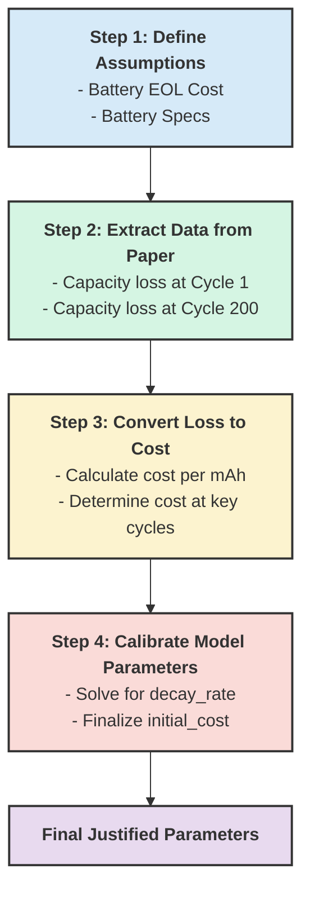

# 📉 Degradation Model Parameter Justification

This document outlines the methodology used to derive the parameters for the `DegradationModel` class, specifically for calculating the cost of SEI (Solid Electrolyte Interphase) film growth. The parameters are based on experimental data from the provided scientific paper and a set of explicit assumptions.

---

## 📄 Reference Paper

**You, H., et al. (2024)**  
*Investigation of lithium-ion battery nonlinear degradation by experiments and model-based simulation*.  
**Energy Storage Materials, 65, 103083**

---

## 🔁 Process Overview

The following flowchart illustrates the steps taken to convert physical data from the research paper into calibrated parameters for our simulation model.



---

## ⚙️ Step 1: Define Core Assumptions

To create a monetary cost model, we must first establish our baseline assumptions:

- **Vehicle Battery Capacity**: 46 kWh *(user-provided spec)*
- **Nominal Voltage**: 350 V *(assumed for calculation)*
- **Battery End-of-Life (EOL)**: 20% capacity loss
- **Battery Replacement Cost at EOL**: €8,000 *(assumed)*

---

## 📊 Step 2: Extract Experimental Data

The reference paper provides quantitative data on capacity loss attributed specifically to **SEI film growth** during high-current cycling experiments:

| Cycle | Capacity Loss (mAh) | Source |
|-------|----------------------|--------|
| 1     | 20 mAh               | You et al., 2024, p.7 |
| 200   | 1.5 mAh              | You et al., 2024, p.7 |

---

## 💰 Step 3: Convert Physical Loss to Monetary Cost

We translate capacity loss (mAh) into a monetary value based on the defined assumptions:

### 🔢 Capacity Calculations

**Total Battery Capacity (mAh):**

```
= 46,000 Wh / 350 V = 131.43 Ah = 131,430 mAh
```

**Total Capacity Loss at EOL (20%):**

```
= 131,430 mAh * 0.20 = 26,286 mAh
```

**Cost per mAh:**

```
= €8,000 / 26,286 mAh ≈ €0.3044 per mAh
```

### 💸 Cost at Key Cycles

- **Cycle 1:**  
  `20 mAh * €0.3044/mAh = €6.088`

- **Cycle 200:**  
  `1.5 mAh * €0.3044/mAh = €0.457`

---

## 📐 Step 4: Calibrate Model Parameters

We use an **exponential decay** function to model the SEI degradation cost:

### 🧮 Formula:

```text
cost(cycle) = initial_cost * e^(-decay_rate * (cycle - 1))
```

### 🎯 Solve for decay rate:

Given:  
```
Cycle 1 cost = 6.088  
Cycle 200 cost = 0.457
```

Use the equation:
```
0.457 = 6.088 * e^(-decay_rate * 199)
```

Take logarithm:
```
ln(0.457 / 6.088) = -decay_rate * 199
-2.589 = -decay_rate * 199
decay_rate ≈ 0.013
```

---

## ✅ Final Justified Parameters

The following parameters are now ready to be used in the `DegradationModel`:

```python

degradation_model = DegradationModel(
    initial_cost=6.088,
    decay_rate=0.013
)

